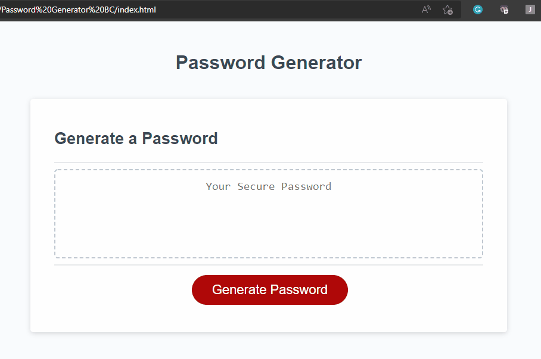
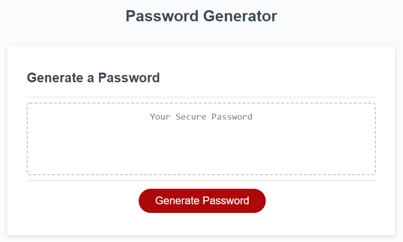
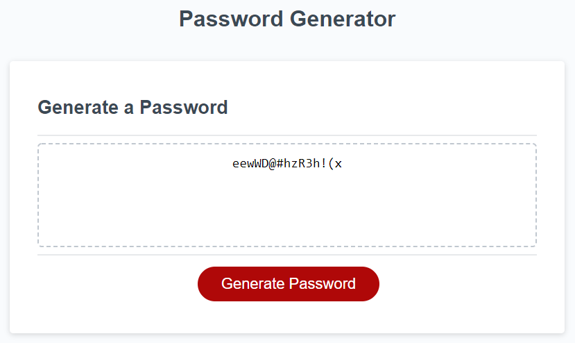

# Password-Generator

# Password-Generator

Password Generator is an application which was assigned as the homework for  week 3 of Monash Uni Bootcamp.

This Challenge requires to modify starter code to create an application that enables employees to generate random passwords based on criteria that they’ve selected.

This app will run in the browser and will feature dynamically updated HTML and CSS powered by JavaScript code . It have a clean and polished, responsive user interface that adapts to multiple screen sizes

## Getting Started

This project has been deployed to GitHub Pages. To get this project up and running, you can follow the deployment link. Or, download the sources files to use this as a template.

Git Hub 

* [GitHub Repository]( https://github.com/gopinathkk/Password-Generator)
* [Deployed GitHub ]( https://gopinathkk.github.io/Password-Generator/)
* [Full Demo Video](https://drive.google.com/file/d/10da4Te-ywl3aBuG3pL4jRAxBcFI6w871/view)

### Prerequisites

To install this application, you will need a text editor. I recommend Visual Studio Code. 

### Installing

To install this code, download the zip file, or use GitHub's guidelines to clone the repository. 

### Summary
* HTML and CSS and Javascript documents create a random password generator 
* This project emphasizes the use of using Javascript to make dynamic changes to an HMTL document

### This project has the following features: 
* A generate button
    * This will send the user a series of prompts and confirms
    * After user data is collected, a random password will be generated using Javascript
    * This application will verify the password to ensure it meets the criteria slected by the user.

    

    * A Textarea
    * This textarea will display the users password once it is generated

    

### Psuedo Code and Project Requirements: 

* The user will be prompted to choose from the following password criteria: 8 and 128 characters

* The user will receive a confirm for: 
    * Password containing lower case, upper case, numbers and  special characters
    *  The application should validate user input and ensure that at least one character type is selected.
    * If, else if statement is used  to validate user selection and to assign the selected items to an arrary.
    * Once all prompts are answered the password will be genearted based on the length and criteria selection, using math.random and math.floor 
    * Once the password is generated, it will be validated to enusre all user selection criteria are met.
    * Event listener will determine the password output of the function to populate the value into the test area.

    ### This project has script features of:
* Variable declaration area 
* An event listener (onclick) called generatePassword
    * This will prompt the user for input between 8-128
    * This will validate that the input is a number within range, or is a number
    * This then uses the input to determine the letters of characters to be used, using an if statement
    * This then assigns values to the variables using arrays for character, number or alphabet
* Another variable is created to concatenate the above variables
* A for loop will loop through the selection of characters until it reaches the number entered by user. 
* A password variable takes the array values from the for loop, and converts it to a string.
* The password will be validated against the user selection. If the password is not containing all types of characters as per user selection , then the password will be regenerated and validate again till all criteria’s are met 
* The string value then populates into the text area for the user using a writePassword function.
* An event listener (onlick) has also been created for the copy to clipboard feature. 

### To Execute File:
> Open in browser

### Features: 
* One HTML Pages
    * index.html 
        * Contains basic user input items and buttons with divs and ids
* One CSS Page
    * styles.css
        * Contains centering and styling for html user input features
        * Contains media queries
* One Javascript Page
    *script.js
        * Contains: 
        * Variables, including arrays and value placeholders
        * event listeners
        * if/else if statements
        * function to generate password
        *functions to verify password validity

## Authors
***Gopinath Krishnankutty [Git Hub Profile]https://github.com/gopinathkk
* Monash Univeristy :© 2022 Trilogy Education Services, LLC, a 2U, Inc. brand. Confidential and Proprietary. All Rights Reserved.

